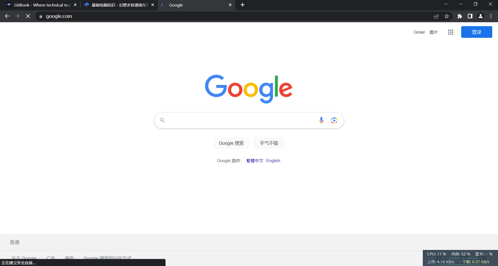

# ✨ 基础电脑知识

## 压缩文件

在互联网上，大量的资源以压缩文件（.zip/.rar/.7z等）的形式传递。它的优势在于可以将大量乱七八糟的小文件一次发送，同时节省带宽和流量。但如果想要查看压缩文件，你必须有一个好用的压缩软件。在未来的Windows 11上，微软将内置rar和7z等格式的支持，但现在还不行！

有些人会问“我的压缩软件为什么需要开通会员？”这不是资源发布者的问题，这是你的问题。你应当使用7zip或6.25版本及之前的bandizip，它们完全免费。当你的压缩软件要求你开会员，你的电脑可能已经被流氓软件入侵了。

有的时候你可能会收到后缀为.kz的使用“快压”打包的压缩文件。对于这种文件，你应当立即将其删除。这是一种非常不道德的文件格式。如果有可能，你还应该透过屏幕给分享者来上一巴掌

## 地址栏

有些人可能分不清地址栏和搜索引擎，然后他们会把链接贴到搜索引擎里面并回车，抱怨为啥打不开

<figure><figcaption>
一个典型的浏览器页面
</figcaption></figure>

对于这张图片而言，上面google.com一行字即为地址栏，如果有人给你发了个链接，你应该把它贴到这个位置，然后回车。而Google图标下面的输入框为搜索栏，这个位置应该输入你的问题，而不是链接。

对于大多数现代浏览器而言，地址栏同样可以作为搜索栏。但反过来不行！


看起来你已经读完了预热部分，那么，握紧你的车票，开往幻想乡的列车即将发车


