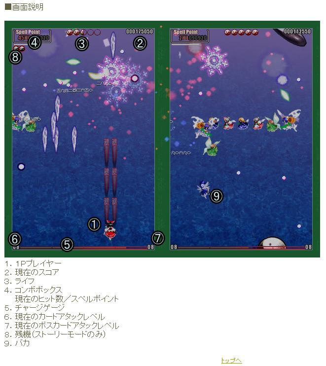

# 9⃣ ⑨

⑨可能是整个东方最出名的数字梗了，在东方语境下，它指琪露诺

这个梗的起源于《东方花映冢》的演示图。zun将演示图中的琪露诺标识为⑨，给的注释是“笨蛋”。然后就⑨就成了琪露诺的代名词（不过琪露诺确实是个baka就是了）

<figure><figcaption>
注意数字9，标识的是琪露诺
</figcaption></figure>

在《天空璋》中，琪露诺晒黑了，然后……⑨就变成了❾。

这个梗还衍生出了⑥，这个我们接下来再说
